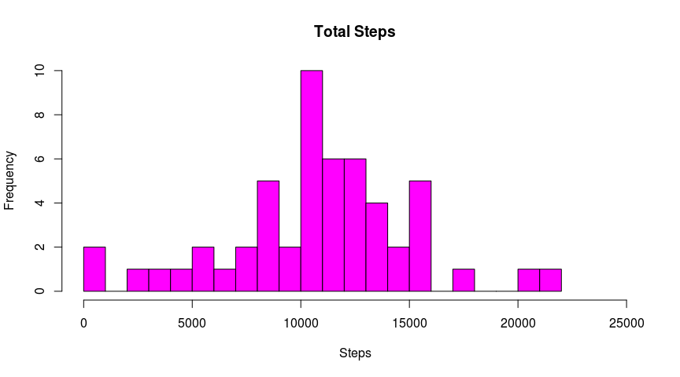
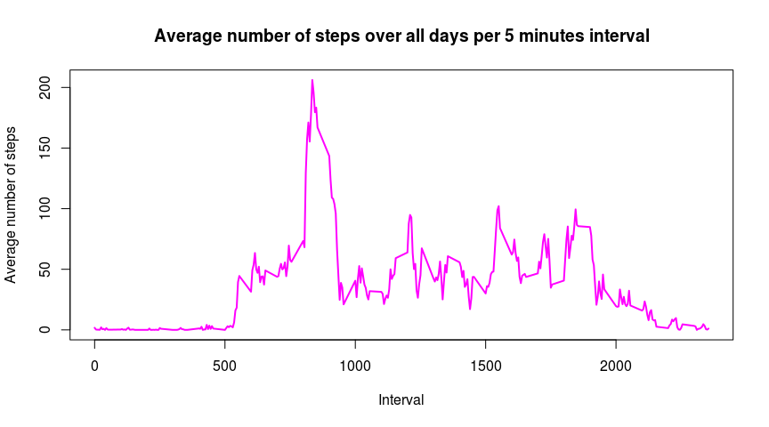
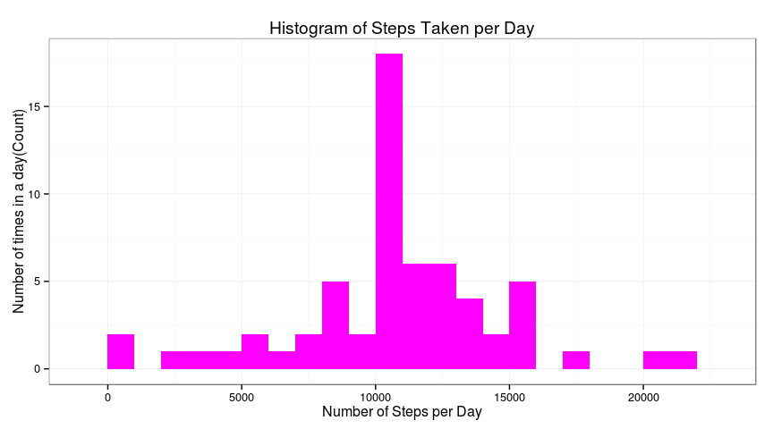

# Reproducible Researc Peer Assessment 1
For this assignement we will start loading the needed libraries 


```r
library(dplyr)
```

```
## 
## Attaching package: 'dplyr'
## 
## The following object is masked from 'package:stats':
## 
##     filter
## 
## The following objects are masked from 'package:base':
## 
##     intersect, setdiff, setequal, union
```

```r
library(knitr)
library(ggplot2)
```


```r
opts_chunk$set(echo = TRUE)
```

## Loading and preprocessing the data


```r
data <- read.csv("/home/fabiofab/RepData_PeerAssessment1/activity.csv")
```


## What is mean total number of steps taken per day?

1. Calculate the total number of steps taken per day

```r
stepsPerDay <- aggregate(data$steps, by = list(data$date), FUN = sum)
names(stepsPerDay) <- c("Date", "Steps")
stepsPerDay$Steps
```

```
##  [1]    NA   126 11352 12116 13294 15420 11015    NA 12811  9900 10304
## [12] 17382 12426 15098 10139 15084 13452 10056 11829 10395  8821 13460
## [23]  8918  8355  2492  6778 10119 11458  5018  9819 15414    NA 10600
## [34] 10571    NA 10439  8334 12883  3219    NA    NA 12608 10765  7336
## [45]    NA    41  5441 14339 15110  8841  4472 12787 20427 21194 14478
## [56] 11834 11162 13646 10183  7047    NA
```
The result show us all the 53 valid values and the 8 days with NAs

2. Histogram of the total number of steps taken each day

```r
hist(stepsPerDay$Steps, xlab = "Steps", xlim = c(0,25000), col = 6, 
     main = "Total Steps", breaks = 30)
```

 

3. Calculate and report the mean and median of the total number of steps taken per day

```r
summary(stepsPerDay$Steps)
```

```
##    Min. 1st Qu.  Median    Mean 3rd Qu.    Max.    NA's 
##      41    8841   10760   10770   13290   21190       8
```

The summary function returns a **mean** value of **10760** and a **median** of **10770**

## What is the average daily activity pattern?

- Make a time series plot (i.e. type = "l") of the 5-minute interval (x-axis) and
the average number of steps taken, averaged across all days (y-axis)

```r
stepsPerInterval <- aggregate(steps ~ interval, data, mean)
head(stepsPerInterval)
```

```
##   interval     steps
## 1        0 1.7169811
## 2        5 0.3396226
## 3       10 0.1320755
## 4       15 0.1509434
## 5       20 0.0754717
## 6       25 2.0943396
```


```r
plot(stepsPerInterval$interval, stepsPerInterval$steps, type='l', 
        col = 6,
        lwd = 2,
        main="Average number of steps over all days per 5 minutes interval", 
        xlab="Interval",ylab="Average number of steps")
```

 


```r
maxStepObservation <- which.max(stepsPerInterval$steps)
stepsPerInterval[maxStepObservation, ]
```

```
##     interval    steps
## 104      835 206.1698
```
As shown in the plot, the *highest number of steps in a 5 minutes interval* is 
**206**

## Imputing missing values
1. Calculate and report the total number of missing values in the dataset (i.e. the total number of rows with NA’s)


```r
nasCount <- sum(is.na(data))
nasCount
```

```
## [1] 2304
```
The total number of missing values in the dataset is **2304**

2. Devise a strategy for filling in all of the missing values in the dataset. The strategy does not need to be sophisticated. For example, you could use the mean/median for that day, or the mean for that 5-minute interval, etc.

To populate missing values, we choose to replace them with the mean value at the same interval across days.

3. Create a new dataset that is equal to the original dataset but with the missing data filled in.

 
We create a function naFill(data, pervalue) which the data arguement is the rdata data frame and pervalue argument is the stepsPerInterval data frame.


```r
naFill <- function(data, pervalue) {
        naIndex <- which(is.na(data$steps))
        naReplace <- unlist(lapply(naIndex, FUN=function(idx){
                interval = data[idx,]$interval
                pervalue[pervalue$interval == interval,]$steps
        }))
        fillSteps <- data$steps
        fillSteps[naIndex] <- naReplace
        fillSteps
}

rdataFill <- data.frame(  
        steps = naFill(data, stepsPerInterval),  
        date = data$date,  
        interval = data$interval)
str(rdataFill)
```

```
## 'data.frame':	17568 obs. of  3 variables:
##  $ steps   : num  1.717 0.3396 0.1321 0.1509 0.0755 ...
##  $ date    : Factor w/ 61 levels "2012-10-01","2012-10-02",..: 1 1 1 1 1 1 1 1 1 1 ...
##  $ interval: int  0 5 10 15 20 25 30 35 40 45 ...
```
Final check for missing values

```r
sum(is.na(rdataFill$steps))
```

```
## [1] 0
```

4. Make a histogram of the total number of steps taken each day and Calculate and report the mean and median total number of steps taken per day. Do these values differ from the estimates from the first part of the assignment? What is the impact of imputing missing data on the estimates of the total daily number of steps?


```r
fillStepsPerDay <- aggregate(steps ~ date, rdataFill, sum)
colnames(fillStepsPerDay) <- c("date","steps")

ggplot(fillStepsPerDay, aes(x = steps)) + 
       geom_histogram(fill = "magenta", binwidth = 1000) + 
        labs(title="Histogram of Steps Taken per Day", 
             x = "Number of Steps per Day", y = "Number of times in a day(Count)") + theme_bw() 
```

 


```r
summary(fillStepsPerDay$steps, na.rm = TRUE)
```

```
##    Min. 1st Qu.  Median    Mean 3rd Qu.    Max. 
##      41    9819   10770   10770   12810   21190
```
We see that the values after filling the data mean and median are equal.


## Are there differences in activity patterns between weekdays and weekends?
